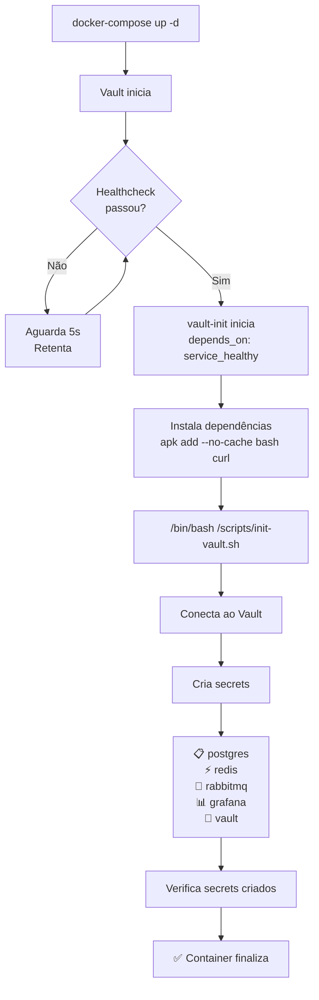

# 🔐 Vault Initialization Flow

## Overview

O sistema de inicialização automática do Vault foi otimizado para garantir que:

1. **Vault inicia** e fica saudável (`service_healthy`)
2. **vault-init** aguarda Vault ficar pronto
3. **vault-init** executa `/bin/bash /scripts/init-vault.sh` com bash nativo (não sh)
4. **Secrets são criados** automaticamente em `secret/dev/*`

## Fluxo de Execução



## Detalhes Técnicos

### Entrypoint Correto

```yaml
vault-init:
  image: alpine:3.19
  depends_on:
    vault:
      condition: service_healthy
  environment:
    VAULT_ADDR: http://vault:8200
    VAULT_TOKEN: agile_dev_token_12345
    VAULT_ENV: dev
  entrypoint: /bin/sh
  command:
    - -c
    - |
      set -e
      apk add --no-cache bash curl
      /bin/bash /scripts/init-vault.sh
      echo "✅ Vault inicializado com sucesso!"
```

### Por que essa estrutura funciona?

1. **Entrypoint `/bin/sh`** — Inicia o container com POSIX shell
2. **apk add bash curl** — Instala dependencies
3. **/bin/bash /scripts/init-vault.sh** — Executa o script COM bash, não com sh
4. **set -e** — Falha se qualquer comando der erro

### Pontos-chave do Script

```bash
#!/bin/bash
set -euo pipefail

# Variáveis com defaults
VAULT_ADDR="${VAULT_ADDR:-http://vault:8200}"
VAULT_TOKEN="${VAULT_TOKEN:-agile_dev_token_12345}"
VAULT_ENV="${VAULT_ENV:-dev}"
```

**✅ Essas linhas PRECISAM de bash**, não funcionam com `/bin/sh`:
- `${VAULT_ADDR:-http://vault:8200}` ← Parameter expansion
- `set -euo pipefail` ← Bash strict mode
- `local -a secret_data=("$@")` ← Array declaration

## Secrets Criados

| Secret | Path | Dados |
|--------|------|-------|
| **PostgreSQL** | `secret/dev/postgres` | username, password, host, port |
| **Redis** | `secret/dev/redis` | password, host, port |
| **RabbitMQ** | `secret/dev/rabbitmq` | username, password, vhost, host, port |
| **Grafana** | `secret/dev/grafana` | admin_password, admin_username |
| **Vault** | `secret/dev/vault` | root_token |

## Como Verificar

### 1. Acessar Vault UI
```bash
# Abra no navegador
http://localhost:8200/ui

# Use o token
agile_dev_token_12345
```

### 2. Navegar para Secrets
1. Clique em "secret/" no menu lateral
2. Clique em "dev/"
3. Você verá os 5 secrets criados

### 3. Verificar via CLI

```bash
# Entrar no container vault
docker-compose exec vault sh

# Ver secrets
vault kv get secret/dev/postgres
vault kv get secret/dev/redis
vault kv get secret/dev/rabbitmq
```

### 4. Verificar Logs

```bash
# Ver logs de vault-init
docker-compose logs vault-init --tail 50

# Ver logs de Vault
docker-compose logs vault --tail 20
```

## Troubleshooting

### ❌ Vault Init Container não executa

**Sintoma**: `docker-compose ps` mostra `vault-init Exited (1)`

**Causas possíveis**:
1. Vault não está `service_healthy`
2. `/scripts/init-vault.sh` não tem permissão de leitura
3. Bash não está instalado

**Solução**:
```bash
# Verificar logs
docker-compose logs vault-init

# Verificar se vault está healthy
docker-compose exec vault curl -s http://localhost:8200/v1/sys/health

# Restartar
docker-compose down && docker-compose up -d
```

### ❌ Secrets não estão sendo criados

**Sintoma**: Vault UI mostra `secret/dev/` vazio

**Verificar**:
1. vault-init executou completamente?
   ```bash
   docker-compose logs vault-init | grep "✅"
   ```

2. Script conseguiu conectar ao Vault?
   ```bash
   docker-compose logs vault-init | grep "Vault está acessível"
   ```

3. Curl consegue fazer request ao Vault?
   ```bash
   docker-compose exec vault apk add --no-cache curl
   docker-compose exec vault curl -H "X-Vault-Token: agile_dev_token_12345" \
     http://localhost:8200/v1/secret/data/dev/postgres
   ```

### ✅ Tudo funcionando

Você verá no logs:
```
🔐 Inicializador de Secrets - Agile Workers Backend

ℹ  Configurações:
   • Vault Address: http://vault:8200
   • Environment: dev
   • Token: agile_...***

ℹ  Testando conexão com Vault...
✓  Vault está acessível!

════════════════════════════════════════════════════════
  Criando Secrets no Vault (dev)
════════════════════════════════════════════════════════

🗄️  PostgreSQL
ℹ  Criando secret: postgres
✓  Secret criado com sucesso

... (mais secrets) ...

✓  Todos os secrets foram inicializados com sucesso!
```

## Próximas Etapas

Após `vault-init` completar com sucesso:

1. **kong-init** irá iniciar (tem `depends_on: vault service_healthy`)
2. **Seus serviços** podem acessar secrets via Vault API
3. **Cleanup**: Remova containers vault-init e kong-init após completarem
   ```bash
   docker-compose rm -f vault-init kong-init
   ```

## Referências

- [Vault API - KV Secrets](https://www.vaultproject.io/api-docs/secret/kv/kv-v2)
- [Docker Compose Healthchecks](https://docs.docker.com/compose/compose-file/compose-file-v3/#healthcheck)
- [depends_on with Conditions](https://docs.docker.com/compose/compose-file/compose-file-v3/#depends_on)
